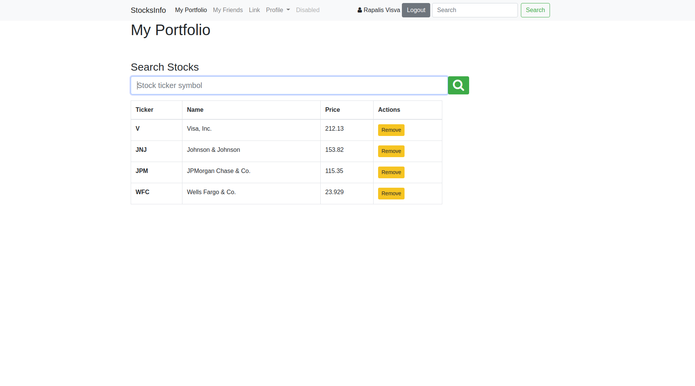

# Social finance app

This is a stock tracker & social media app, built with Ruby on Rails, where registered users can find recent stock prices, add them to a favorites list, and find/favorite the stocks that other users are tracking.

 

## Built With

- Ruby on Rails
- HTML & CSS
- Javascript
- iexcloud API

## Authors

👤 **Visvaldas Rapalis**

- Github: [@visva-dev](https://github.com/visva-dev)
- Twitter: [@Visva_Dev](https://twitter.com/Visva_Dev)
- Linkedin: [@Visvaldas-Rapalis](https://www.linkedin.com/in/visvaldas-rapalis/)

## 🤝 Contributing

Contributions, issues and feature requests are welcome! Start by:

- Forking the project
- Cloning the project to your local machine
- `cd` into the Youtube-Replica project directory
- Run `git checkout -b your-branch-name`
- Make your contributions
- Push your branch up to your forked repository
- Open a Pull Request with a detailed description to the development branch of the original project for a review

## 📝 License

This project is [MIT](https://opensource.org/licenses/MIT) licensed.
